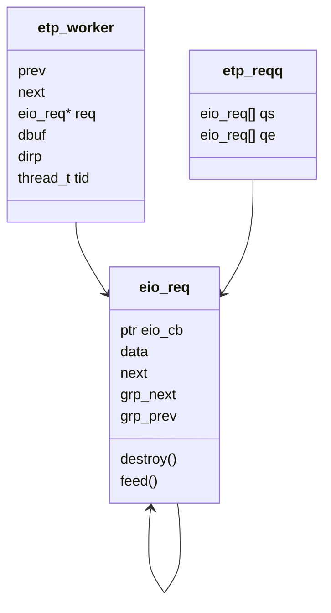
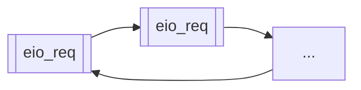
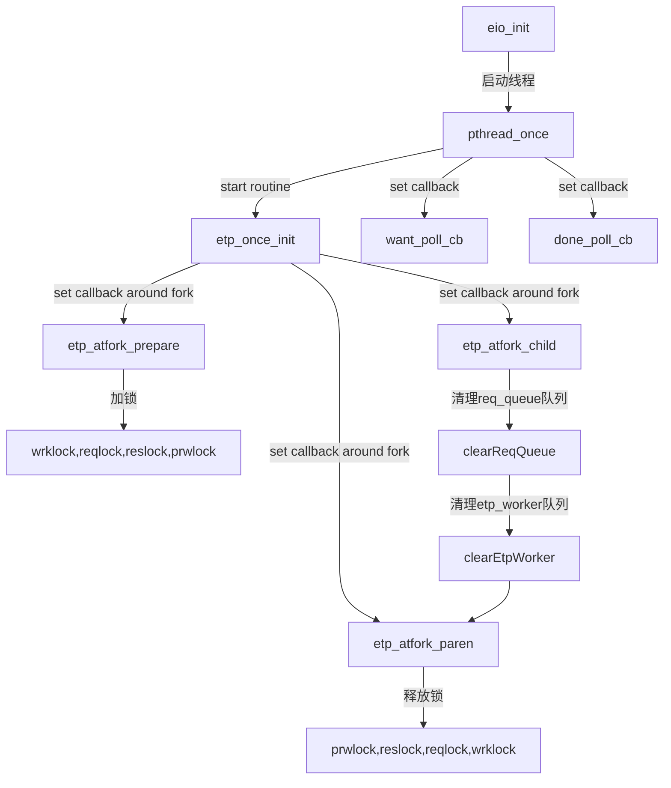
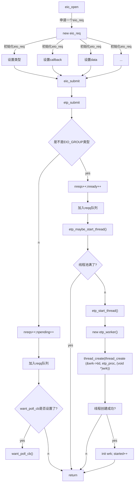
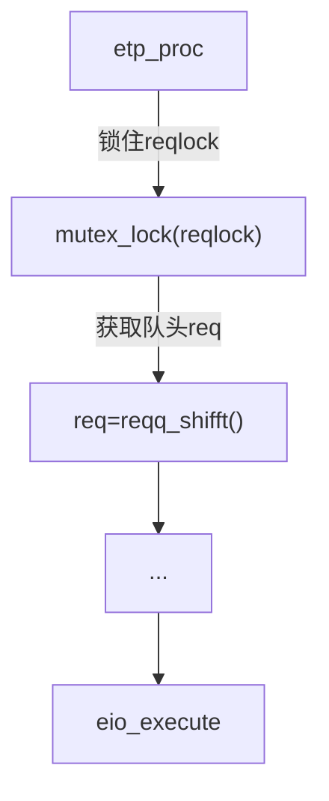

#### 主要数据结构


#### eio_reqq环形队列(req_queue)


#### 核心运行流程(eio_init)


#### 核心接口(eio_open为例)


#### 核心运行流程(etp_proc: 所有线程的routine)



#### 核心运行流程(eio_execute)
```mermaid
graph TD

eio_execute --传入etp_worker,eio_req--> switch{判断req类型} --> idRead[READ] & WRITE & OPEN & ...;
idRead --> id3["POSIX read()"]
````