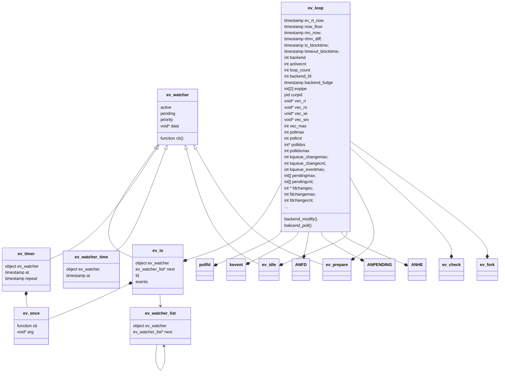
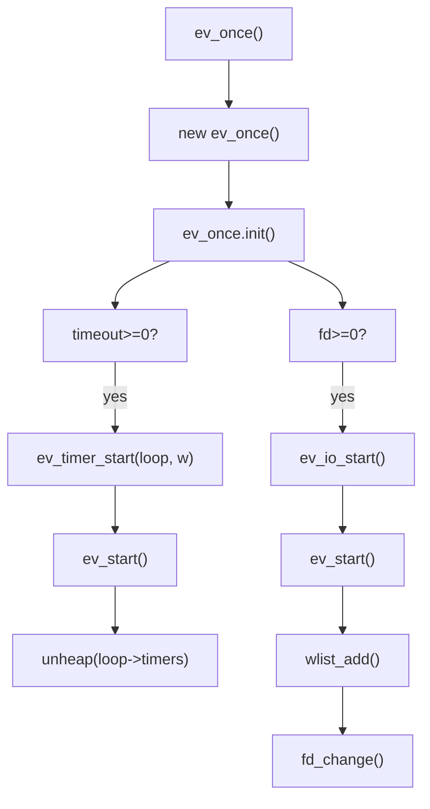
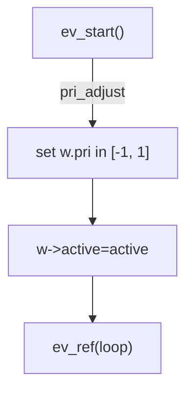

#### 主要数据结构

```mermaid
classDiagram

  ev_watcher <|-- ev_io
  ev_watcher <|-- ev_timer
  ev_watcher <|-- ev_watcher_time
  
  ev_io *-- ev_once
  ev_timer *-- ev_once

  ev_io --> ev_watcher_list
  ev_watcher_list --> ev_watcher_list

  class ev_io {
    object ev_watcher
    ev_watcher_list* next
    fd
    events
  }

  class ev_timer {
    object ev_watcher

    timestamp at
    timestamp repeat
  }

  class ev_watcher_list {
    object ev_watcher
    ev_watcher_list* next
  }

  class ev_once {
    function cb
    void* arg
  }

  class ev_watcher {
    active
    pending
    priority
    void* data
    function cb()
  }


  class ev_watcher_time {
    object ev_watcher
    timestamp at
  }
 

  class ev_loop {
    timestamp ev_rt_now
    timestamp now_floor
    timestamp mn_now;
    timestamp rtmn_diff;
    timestamp io_blocktime;
    timestamp timeout_blocktime;

    int backend
    int activecnt

    int loop_count
    int backend_fd
    timestamp backend_fudge

    backend_modify()
    bakcend_poll()
    int[2] evpipe

    pid curpid
    void* vec_ri
    void* vec_ro
    void* vec_wi
    void* vec_wo
    int vec_max

    int pollmax
    int pollcnt
    int* pollidxs
    int pollidxmax
    int kqueue_changemax;
    int kqueue_changecnt;
    int kqueue_eventmax;

    int[] pendingmax;
    int[] pendingcnt;

    int * fdchanges;
    int fdchangemax;
    int fdchangecnt; 
    ...
  }


  ev_loop --* ev_io
  ev_loop --* pollfd
  ev_loop --* kevent
  ev_loop --* ANFD
  ev_loop --* ANPENDING
  ev_loop --* ANHE
  ev_loop --* ev_idle
  ev_loop --* ev_prepare
  ev_loop --* ev_check
  ev_loop --* ev_fork

  ev_watcher<|-- ev_idle
    ev_watcher<|-- ev_prepare

```

#### 关键过程分析

```mermaid
graph TD
  evOnce["ev_once()"] --> newEvOnce["new ev_once()"] --> initEvOnce["ev_once.init()"]

  initEvOnce --> fdJudge["fd>=0?"] --yes--> evIOStart["ev_io_start()"]
  initEvOnce --> timeoutJudge["timeout>=0?"] --yes--> evTimerStart["ev_timer_start(loop, w)"]


  evTimerStart --> evStart["ev_start()"] --> unheap["unheap(loop->timers)"]

evIOStart --> evStart2["ev_start()"] --> wListAdd["wlist_add()"] --> fdChange["fd_change()"]

```

```mermaid
graph TD
evStart["ev_start()"] --pri_adjust--> priAdjust["set w.pri in [-1, 1]"] --> activeW["w->active=active"] --> evRef["ev_ref(loop)"]
```