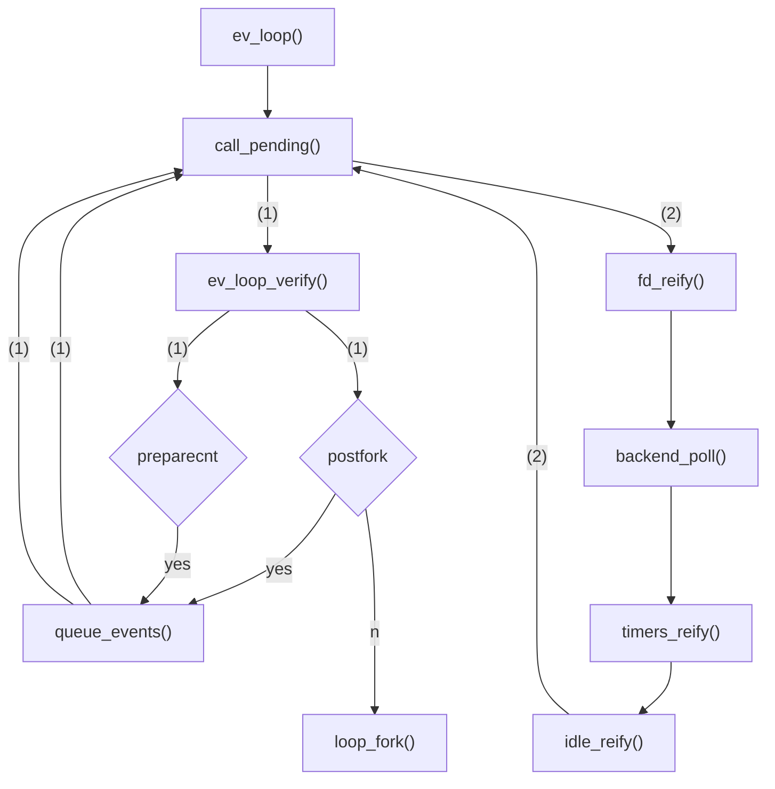
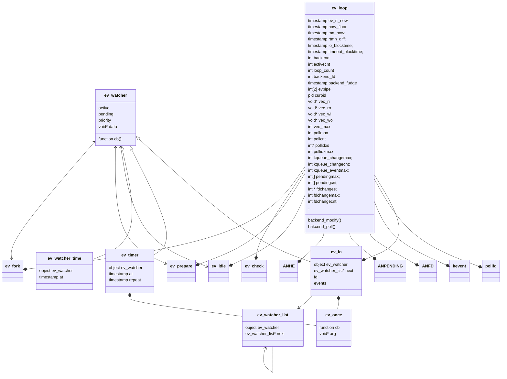
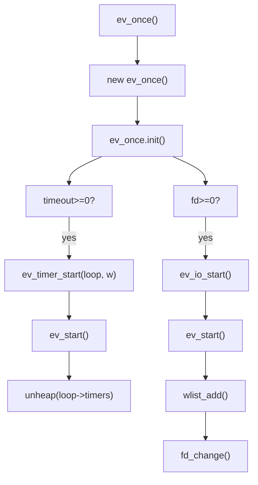
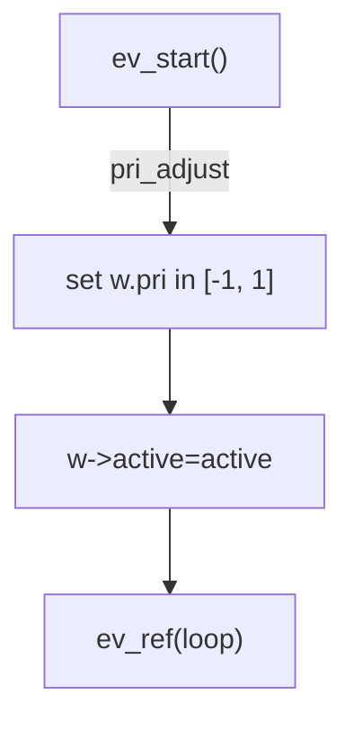

# node-0.0.1源码中的libev

#### 目录结构
.
├── ev++.h                // libev simple C++ wrapper classes
├── ev.c                  // libev event processing core, watcher management
├── ev.h                  // libev native API header
├── ev_epoll.c            // libev epoll fd activity backend
├── ev_kqueue.c           // libev kqueue backend
├── ev_poll.c             // libev poll fd activity backend
├── ev_port.c             // libev solaris event port backend
├── ev_select.c           // libev select fd activity backend
├── ev_vars.h             // loop member variable declarations
├── ev_win32.c            // libev win32 compatibility cruft (_not_ a backend)
├── ev_wrap.h
├── event.c               // libevent compatibility layer
├── event.h               // libevent compatibility header, only core events supported
└── event_compat.h


#### ev_loop的启动入口
ev.c:  void ev_loop (EV_P_ int flags);

调用路径:


从上面看，call_pending()是一个核心的函数。
下面看下call_pending()的逻辑

```C
void static inline
call_pending (struct ev_loop *loop)
{
  int pri;
  // 看起来是5个优先级队列
  for (pri = 5; pri--; )
    // 每个优先级队列遍历一遍
    while (((loop)->pendingcnt) [pri])
      {
        // 从优先级队列中取出了一个loop实例。取的方法没看明白，和优先级队列的组织结构有关
        ANPENDING *p = ((loop)->pendings) [pri] + --((loop)->pendingcnt) [pri];
        if (__builtin_expect (((p->w) != 0),(1)))
          {
            p->w->pending = 0;
            (p->w)->cb (loop, (p->w), (p->events));
          }
      }
}

```

从上面看，ev_loop的每个tick会经历几个重要的流程/阶段:
- 调用queue_events()检查loop->pending队列
- 调用backend_poll()检查epoll各个fd的结果
- 调用timers_reify()检查各个timer
- 调用idle_reify()执行同步代码


接下来先看下queue_events(),了解下loop->pending队列的管理:
1. queue_events()往loop->pending添加event: 调用ev_feed_event(struct ev_loop*, void* w, int revents)
添加的是void* w, 一个ev_watcher* 类型
2. 


#### 主要数据结构



#### 关键过程分析



